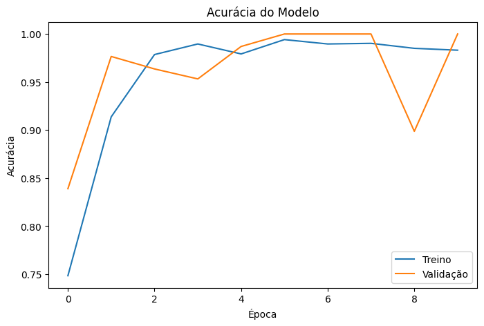
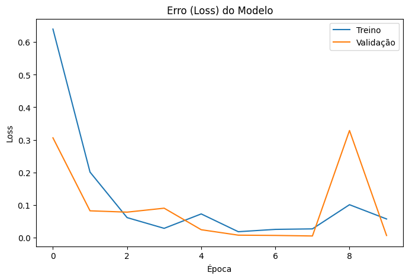

# 🌱 IA-Agricultura-Drone

Sistema de Inteligência Artificial para classificação de imagens agrícolas obtidas por drones e estimativa de vigor vegetativo utilizando Redes Neurais Convolucionais (CNN).

## 📋 Objetivo

Desenvolver um sistema capaz de analisar imagens agrícolas obtidas por drones, identificar padrões visuais presentes nas lavouras e estimar o vigor vegetativo com base na cobertura vegetal detectada.

## 🚁 Aplicação

O projeto foi desenvolvido com foco em Agricultura de Precisão, permitindo automatizar análises que normalmente exigiriam inspeções manuais em campo.

## 🧠 Tecnologias Utilizadas

* Python
* TensorFlow
* Keras
* OpenCV
* NumPy
* Matplotlib
* Scikit-Learn
* Gradio
* Google Colab

## 📊 Dataset

O conjunto de dados utilizado possui 1.927 imagens agrícolas divididas em quatro classes:

* Dolomite gypsum
* Fallow (left bare)
* Indian mustard (Brassica juncea)
* Rice husk charcoal

## ⚙️ Arquitetura

Foi utilizada uma Rede Neural Convolucional (CNN) composta por:

* Camadas Convolucionais
* Max Pooling
* Camadas Densas
* Dropout para redução de overfitting

## 📈 Resultados

O modelo apresentou excelente desempenho durante a validação:

* Accuracy: 100%
* Precision: 100%
* Recall: 100%
* F1-Score: 100%

## 🌿 Funcionalidades

* Classificação automática de imagens agrícolas
* Identificação da cobertura vegetal
* Estimativa de vigor vegetativo
* Interface de análise utilizando Gradio

## 📁 Arquivos do Projeto

* Projeto_IA_Agricultura_Final.ipynb
* Modelo de artigo técnico-científico final.pdf
* Acurácia.png
* Loss.png
* Matriz de confusão.png
* Vigor Vegetativo.png

## 👨‍🎓 Autor

Kenzo Ramos Otaguiri

Bacharelado em Sistemas de Informação

Universidade de Uberaba (UNIUBE)

2026
## 📊 Resultados

### Evolução da Acurácia

### Evolução do Erro (Loss)

### Matriz de Confusão

### Análise de Vigor Vegetativo

